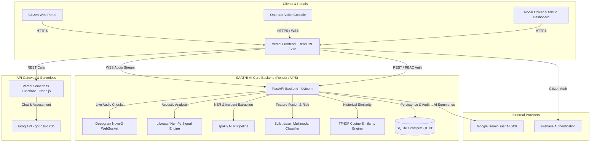

# SAATHI-AI & NHAA Case Intelligence Platform (14566)

[](https://fastapi.tiangolo.com)
[](https://react.dev)
[](https://www.typescriptlang.org)
[](https://vitejs.dev)
[](https://www.python.org)
[](https://github.com/aquasecurity/trivy)

An enterprise-grade, security-hardened multimodal AI case intelligence and emergency decision-support platform engineered for the **National Helpline Against Atrocities (NHAA - 14566)**, Department of Social Justice and Empowerment (MoSJ&E), Government of India (SIH26093).

---

## 🏛️ Project Overview

The **SAATHI-AI** system provides end-to-end operational intelligence for emergency distress calls, citizen grievances, nodal officer investigations, and administrative oversight under the SC/ST (Prevention of Atrocities) framework:

- **Citizen Assistance**: Anonymous or Google-authenticated grievance filing, real-time stress assessment, anonymous resolution tracking (`CITIZEN-ANON-XXXX`), and an automated conversational counselor.
- **Engine 1 — Real-Time Operator Copilot**: Dual-channel streaming speech-to-text (Deepgram Nova-2 WebSocket), live speaker diarization, real-time acoustic feature extraction, Hindi/Hinglish distress indicator classification, and multimodal risk level prediction (Scikit-Learn Random Forest).
- **Engine 2 — Historical Precedent Intelligence**: TF-IDF cosine similarity against legal precedents and archived case resolutions to recommend triage paths and dispatch protocols.
- **Officer & Admin Dashboard**: District-level triage queue, severity indicators, manual override tracking, national analytics, and tamper-evident audit trails.

---

## 🏗️ Architecture



---

## 🔒 Security Hardening & Audit Certification

The codebase has undergone comprehensive Static Application Security Testing (SAST) and software supply chain audits using **Aqua Security Trivy v0.74** and **Semgrep CLI**:

| Security Domain | Hardened Implementation |
| :--- | :--- |
| **Authentication** | Cryptographic RS256 signature verification of Firebase ID tokens against Google's public x509 certificates. |
| **Session Security** | Ephemeral 384-bit cryptographically secure random secret generation for JWT in development; strict environment requirement in production (`RuntimeError` on missing secret). |
| **CORS Policy** | Pinned explicit allowlist (`https://nhaa-portal.vercel.app`, local dev origins) with wildcard subdomain regexes permanently eliminated. |
| **Access Control (RBAC)** | Strict role enforcement across `Admin`, `Nodal Officer`, `Operator`, `Viewer`, and `Citizen`. Mutating endpoints blocked with HTTP 403 for read-only viewers. |
| **Rate Limiting** | In-memory sliding-window request throttling with HTTP 429 backoff headers. |
| **Audit Trail & Sanitization** | Comprehensive logging of all case access, overrides, and escalations with automatic redaction of API keys, passwords, and tokens. |
| **Dependencies** | Vulnerabilities patched (`python-multipart>=0.0.20`, `pyjwt>=2.10.1`, `python-dotenv>=1.0.2`, `scikit-learn>=1.5.0`). |
| **ReDoS Prevention** | Set-based $O(N)$ token matching in language detection hot paths, eliminating regular expression backtracking risks. |

---

## 🚀 Quick Start & Local Setup

### 1. Prerequisites
- **Node.js** 18+ and **npm**
- **Python** 3.11+
- **Git**

### 2. Clone the Repository
```bash
git clone https://github.com/yogesshh-27/NHAA-Dummy-Final.git
cd NHAA-Dummy-Final
```

### 3. Environment Configuration
Create a local `.env` file in the root directory (based on `.env.example`):
```bash
cp .env.example .env
```
Key variables:
```env
GROQ_API_KEY=your_groq_api_key
GROQ_MODEL=openai/gpt-oss-120b
DEEPGRAM_API_KEY=your_deepgram_api_key
JWT_SECRET=your_long_random_jwt_secret_key_here
ALLOWED_ORIGINS=http://localhost:5173,https://nhaa-portal.vercel.app
VITE_SAATHI_API_URL=http://127.0.0.1:8000
```

### 4. Install & Run Frontend
```bash
npm install
npm run dev
```
The citizen and admin portal will be available at `http://localhost:5173`.

### 5. Install & Run Python Backend
```bash
# In a separate terminal
cd backend
python -m pip install -r requirements.txt
python -m uvicorn app.main:app --host 0.0.0.0 --port 8000 --reload
```
The FastAPI documentation and OpenAPI schema will be available at `http://localhost:8000/docs`.

---

## 🧪 Automated Testing

The project includes automated security and functional test suites verifying the end-to-end platform:

```bash
# 1. Run Complete Security Hardening Test Suite (RBAC, Rate Limiting, Audit Sanitization)
python backend/test_security_hardening.py

# 2. Run REST API Endpoints & Case Management Suite
python backend/test_api_endpoints.py

# 3. Run NHAA Multimodal AI Platform Integration Suite (9 Modules)
python backend/test_nhaa_platform.py
```

---

## 📡 API Reference

| Method | Endpoint | Access | Purpose |
| :--- | :--- | :--- | :--- |
| `GET` | `/health` | Public | System telemetry, engine status, and security posture |
| `POST` | `/api/auth/login` | Public | Native JWT login returning access token and role |
| `POST` | `/api/auth/firebase-verify` | Public | Firebase ID token verification and exchange |
| `POST` | `/api/complaints/submit` | Public / Citizen | File grievance with automatic NLP and risk classification |
| `GET` | `/api/cases/track/{id}` | Public / Citizen | Anonymous case resolution and status tracker |
| `GET` | `/api/cases` | Operator / Officer / Admin | Filterable case queue with risk levels and indicators |
| `GET` | `/api/cases/{case_id}` | Operator / Officer / Admin | Complete case dossier with transcripts and emotion analysis |
| `POST` | `/api/cases/{case_id}/triage` | Operator / Officer / Admin | Mutate case status, priority, and assign nodal officer |
| `GET` | `/api/officer/dashboard` | Nodal Officer / Admin | Urgent escalated cases, district alerts, and metrics |
| `GET` | `/api/admin/analytics` | Admin | National analytics, SLA compliance, and cluster breakdowns |
| `GET` | `/api/audit-logs` | Officer / Admin | Tamper-evident audit trail with automated sanitization |
| `WS` | `/api/deepgram/ws/{session_id}` | Operator / Client | Real-time dual-channel audio streaming & risk classification |

---

## 📄 License & Attribution

Developed for the **National Helpline Against Atrocities (NHAA - 14566)** under the Scheduled Castes and the Scheduled Tribes (Prevention of Atrocities) Act. Department of Social Justice and Empowerment, Government of India.
